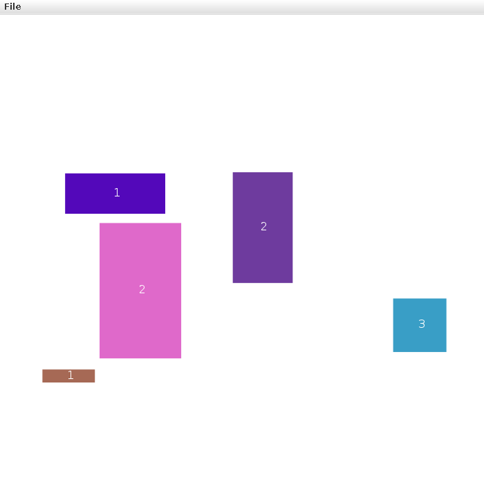

# rectangle-game 🟪

[](https://github.com/pkgoesdigital/rectangle-game/actions/workflows/build.yml)

Rectangle freeze tag — a Java/StdDraw game from Q1 of programming (2018),
modernized in 2026 so it builds and runs again.



Five rectangles bounce around the canvas, each showing how many clicks it
has left. Click one to decrement its counter; take it to zero and it freezes
solid red. But a frozen rectangle is freed if a moving one bumps into it —
so you have to freeze all five before they rescue each other. Freeze them
all and you win.

```bash
./gradlew run     # play
./gradlew test    # 22 unit tests, headless
./gradlew build   # compile + test
```

You need a JDK (21 recommended) — Gradle downloads everything else,
including StdDraw.

## What was modernized (2026)

### It couldn't be built at all

The 2018 project was an Eclipse project whose `.classpath` said:

```xml
<classpathentry kind="con" path="org.eclipse.jdt.USER_LIBRARY/StdDraw"/>
```

That's a library registered inside **one** Eclipse installation. The jar was
never in the repo and nothing recorded where to get it, so `git clone` gave
you two files importing a class that didn't exist. It could not compile for
anyone — including future-Paula on a new laptop. `build.gradle` now declares
the dependency, so the build is reproducible on any machine.

Also gone: the compiled `.class` files that were committed under `bin/`, and
a `.gitignore` that was written for **Go and JavaScript** (`*.cgo1.go`,
`node_modules/`, `bower_components/`) and therefore ignored none of them.

### The StdDraw dependency

There is no perfect StdDraw artifact any more, so this is the tradeoff made:

| | package | API |
|---|---|---|
| Maven `…:stdlib:1.0.1` (2014) | ✅ `edu.princeton.cs.introcs` | ❌ older |
| Princeton's current `stdlib.jar` | ❌ default package | ✅ current |
| Paula's 2018 Eclipse library | ✅ | ✅ (gone) |

The Maven artifact wins, because a declared dependency any machine can
resolve beats an API detail. Two call sites adapt to its slightly older API:

- `isMousePressed()` → `mousePressed()`
- `enableDoubleBuffering()` + `show()` + `pause(20)` → `show(20)`

Those aren't a downgrade in behaviour: Princeton's own javadoc for `show(int t)`
says it "copies the offscreen buffer to the onscreen buffer, pauses for t
milliseconds and enables double buffering" — the newer trio is literally its
documented replacement.

### Bugs fixed

- **Every rectangle started black.** `randomColor()` was never called in the
  constructor, so `r`/`g`/`b` stayed `0` and `setPenColor(0,0,0)` painted
  black until the rectangle happened to hit a wall. Now coloured at birth —
  which is what the screenshot above is showing.
- **Click counts were randomized twice.** `unfreeze()` rolled a new count,
  then the driver immediately called `resetRemainingClicks()` and rolled
  another. `unfreeze()` owns it now.
- **A statement that did nothing.** `rectangles[j].isFrozen();` — the result
  was discarded. Freezing now also zeroes the counter (`setRemainingClicks(0)`),
  which is what the surrounding `clicks = 0;` line was reaching for.
- **The constructor assigned `width`/`height` twice**, with comments claiming
  to "account for halfWidth" while doing nothing of the kind. They *are*
  half-extents — because `StdDraw.filledRectangle` takes half width and half
  height — so that's now said once, accurately.

## Tests

`MovingRectangleDriver` is a `while (true)` loop drawing to a window, so it
can't be unit tested. But `MovingRectangle` — everything that decides what
the game *does* — is pure logic, and is now covered by 22 JUnit tests:
movement, wall bouncing (including a 5000-tick run asserting a rectangle can
never escape the canvas), freeze/unfreeze, the click counter, collision
symmetry and edge cases, mouse hit-testing, and colour.

The tests run headless (`java.awt.headless=true`) so they can never hang a
CI runner on a window. CI also does the other half: it starts the real game
on a virtual X display and fails if it exits or throws instead of animating.
